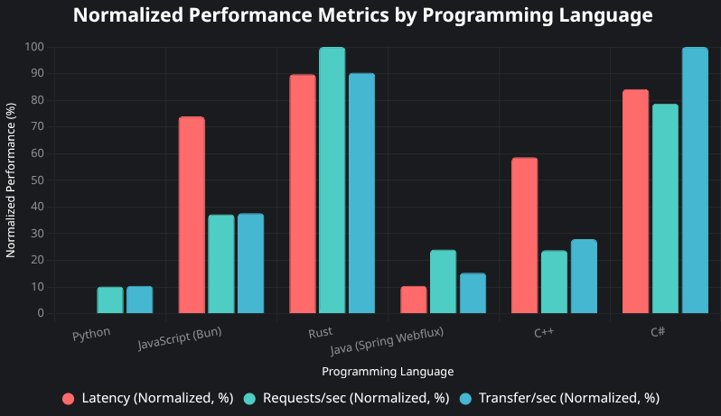

# Web Frameworks Benchmark 🚀

Welcome to [github.com/Abhishek2010dev/web-frameworks-benchmark](https://github.com/Abhishek2010dev/web-frameworks-benchmark)! This repo compares web frameworks across languages, testing a simple `/ping` endpoint with `wrk` to measure **latency**, **requests/sec**, and **transfer rate**. 📊

## Purpose 🎯
To provide a clear, reproducible benchmark of web frameworks, helping you pick the best for performance, safety, and versatility.

## Framework Selection Criteria ✅
Frameworks were chosen based on:
1. **No Unsafe Code** 🛡️: Ensures reliability and security.
2. **General Use** 🌐: Suitable for a wide range of web apps.
3. **Speed** ⚡: Optimized for low latency and high throughput.

## Benchmarks 📈
We test a `/ping` endpoint using `wrk` (8 threads, 100 connections, 30s duration). Metrics:
- **Latency (ms)**: Average response time.
- **Requests/sec**: Requests handled per second.
- **Transfer/sec (MB/s)**: Data transfer rate.

See the chart above for normalized results comparing Python, JavaScript (Bun), Rust, Java (Spring Webflux), C++, and C#.

## Contributing 🤝
Add frameworks or optimize existing ones! Submit PRs, ensuring the criteria are met.

